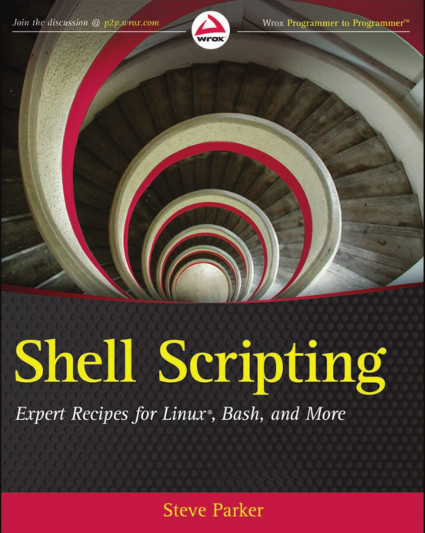

# Shell Programming
## An Introduction
## by Andrew Worsley

---

# Really important because:
* Capture that hardwon knowledge
* Save on mistakes/errors
* Automate - work vastly faster
* Step up to the next level of power

---

# A Complex Command
### Don't waste that knowledge and experience

    !sh
    % find . -mtime -7 -type f -print

### Make a shell function

    !sh
    % newfiles() {
       find . -mtime -7 -type f -print
    }

---
# Now you can build on it

### Add an argument to make it flexible

    !sh
    % newfiles() {
        find . -mtime "-${1:-7}" -type f -print
     }

### Now files less than 10 days old

    !sh
    % newfiles 10

---
# Save it forever

### Append it to your .bashrc or start up scripts

    !sh
    % cat >> ~/.bashrc  
    newfiles() {
       find . -mtime "-${1:-7}" -type f -print
    }  
    ^D  
    % . ~/.bashrc  

### Check if it is defined

    !sh
    % which newfiles  
    newfiles () {  
        find . -mtime "-${1:-7}" -type f -print  
    }

---

# Multiple Commands

    !sh
    echo "Full backup of home"
    sudo dump -0au -z -f - /home \ 
     | ssh -p123 backup-pc dd of=/backups/machine/D_L0.dump bs=1M

* Don't waste that knowledge and experience
* Put this into function!
* To do this efficiently there are some tricks...

---
# Shell functions
## Arguments $N ... and $#
    $ fn () {
        echo $1 and $2
        echo no. of args is $#
    }
## Calling
    $ fn hi there programmer
    hi and there
    no. of args is 3

## Return only one byte 0-255 via $?
    $ myfunc() {
        return 3
    }
    $ myfunc
    $ echo $?
    3

---

# Shell Variables
## Shell Expansion
## Joining/default value
## Prefix/postfix changing
## Pattern substitution
## Wild cards
    !sh
    #! /bin/sh
    set -x
    COUNT=2
    echo $COUNT
    V=${1:-"hello"}
    B=${2:-"world"}
    C=${B%ef}
    #C=${B/a*/def}
    echo A=$A B=$B REST=$*
    shift 2
    echo Now REST=$*

---

# Kick start with a template
Preload valuable help and debug features with
a common fragment

    !sh
    #! /bin/sh

    usage()
    {
       echo "$(basename $0): Description of script"
       echo ""
       echo "-h : This usage information"
       echo "-n : Dry-run print commands instead of executing them"
       echo "-x : Enabling tracing of shell script"
    }

    while getopts 'nxhA:' argv
    do
	case $argv in
	n)
	   echo "Dry-Run"
	   DR=echo
	;;
	x)
	    echo "Enabling tracing"
	    set -x
	;;
	#A) ARG="$OPTARG" ;;
	h) usage ;;
	esac
    done
    shift $(($OPTIND-1))
    echo "Do stuff here"

---
# Copy template as the base
### cp ex.sh newscript.sh
* Saves typing/debugging/remembering stuff
* Really makes it easy to re-use/extend work
* Prompts you to document it for later retrieval
* Builtin debugging / diagnostics

Preserves all that information and knowledge
you've worked out to get the tools running.
This preserves it for easy use later. It serves
as a extensible platform to easily add new features
or options later on.
As it hides all the funny options and complexity
in an easy to use command you will use it more often
and easily on the command line and as part of other
scripts.

---

# Common options
## Really help you extend/debug
* -h = usage
* -n = dry run - print commands don't run them!
* -x = shell debugging set -x mode
## Common argument parsing 
 Adds above options by default and lets you
easily extend / improve your code snippet.

---
# Re-using functions
## Local to scope variables
    $ newfunc () {
        local I=3
        echo "I=$I"
    }
    $ I=10
    $ newfunc
    I=3
    $ echo $I
    10

# Including files
### Use . to share common code
    # Get lsb functions
    . /lib/lsb/init-functions
### Useful for common functions
---
# Common shell functions
### Improve the debugging with die() method
    die() {
        echo $1 && exit $2
    }
    run () {
        RES=$($*)
        if [ $? != "0" ]; then
            echo "$* : Failed $?"
        fi
    }

### Dump out calling line/error message
    die() {
        echo $1
        echo "In function ${FUNCNAME[1]} "
        echo " at line ${BASH_LINENO[1]} of ${BASH_SOURCE[1]}"
        exit $2
    }
#### bash only
---

# Key builtins
## read  to prompt for data into variable
## test or [ or [[
### -e -x -f -r -w
## arithmetic $(($x+1))
## $() or \` \`

    !sh
    #! /bin/sh
    echo "Hi $(whoami), enter minimum size in K to find and directory"
    read SZK dir
    if [ ! -d $dir ]; then
        echo "Sorry $dir is *NOT* a directory: $dir"
        exit 1
    fi
    echo "Looking for files $(($SZK*1024)) bytes or bigger in $dir"
    find $dir -type f -size +${SZK}k -exec du -h \{} \;
---
# Basic control
## cmd1 || cmd2 ...

    !sh
    cat $file || echo "Unknown file $file"

## cmd1 && cmd2 ...

    !sh
    make prog && ./prog && echo "Program prog compiled and ran ok"
---
# Flow control 1
### while ... do ... done

    !sh
    while [ $C -lt 10 ]; do
        C=$(($C + 1))
        echo "Try $C"
        sleep $S 
    done

---

# Flow control 2
### if ... then ... elfi ... else ... fi
### break / continue

    !sh
    while [ $C -lt 10 ]; do
        C=$(($C + 1))
        echo "Try $C"
        if $DR $* ; then
            echo "Ok"
        else
            echo "Failed $?"
            break
        fi
        sleep $S 
    done

---
# Flow control 3 - sh-flow.sh
### case ... in ... esac - far better than if

    !sh
    N=10
    while [ $C -lt $N ]; do
        C=$(($C + 1))
        echo "Try $C"
        if $DR $* ; then
            echo "Ok"
        else
            echo "Failed $?"
            break
        fi
        sleep $S 
    done
    case $C in
    $N) echo "Ran '$*' $N times with no failures";;
    *)
      echo "$* : Failed on try $C"
      exit 1
    ;;
    esac
---

# Various shells
## Warning: dash vs bash
### dash - 31 page manual, most things, faster
    !sh
    #! /bin/sh
    I=1
    x[$I]=hello  ==> Error 

### bash - 123 page manual, extra things, arrays
    #! /bin/bash
    I=1
    x[$I]=hello
    echo ${x[$I]} ==> hello

### zsh csh and others....
### Script any program sed, awk, ...

---
# File redirection - run-tests.sh
## Combine with < or > or >> or |
    !sh
    testcases="tests.txt"
    echo "Running $testcases"
    echo "Running testcases from $testcases" > results
    F=0
    while read TC
    do
	C=${TC%#*}
	if [ ! "$C" ]; then
	    continue
	fi
	if eval $C ; then
	    echo $C : Passed >> results
	else
	    echo $C : Failed >> results
	    echo $C : Failed
	    F=$(($F+1))
	fi
    done < $testcases
    echo "$(grep 'Passed$' results | wc -l) Passed $F Failed"
---
# More tricks with files
### Explicit file descriptor 1> and 2> 
    $ ls -l /proc/self/fd > /tmp/stdout.txt 2> /tmp/err.txt
    $ cat /tmp/stdout.txt
    total 0
    lrwx------ 1 amw amw 64 Nov  6 11:22 0 -> /dev/pts/1
    l-wx------ 1 amw amw 64 Nov  6 11:22 1 -> /tmp/stdout.txt
    l-wx------ 1 amw amw 64 Nov  6 11:22 2 -> /tmp/err.txt
    lr-x------ 1 amw amw 64 Nov  6 11:22 3 -> /proc/16405/fd
### If file common can use 2>&1 (or >&)
    $ ls -l /proc/self/fd > /tmp/stdout.txt 2>&1

---
# Shell's fd
####  N> Output
    $ exec 3> /tmp/testing
####  N< Input
    $ exec 4< /tmp/input
    $ ls -l /proc/self/fd
    total 0
    lrwx------ 1 amw amw 64 Nov  6 12:10 0 -> /dev/pts/4
    lrwx------ 1 amw amw 64 Nov  6 12:10 1 -> /dev/pts/4
    lrwx------ 1 amw amw 64 Nov  6 12:10 2 -> /dev/pts/4
    l-wx------ 1 amw amw 64 Nov  6 12:10 3 -> /tmp/testing
    lr-x------ 1 amw amw 64 Nov  6 12:10 4 -> /tmp/stdout.txt
    lr-x------ 1 amw amw 64 Nov  6 12:10 5 -> /proc/16799/fd
#### Append with >&N
    $ echo hello >&3
    $ echo world >&3
    $ cat /tmp/testing
    hello
    world
### Read fd
    $ cat <&4
---

# processes
### & - background
    du -shx /lib &
### wait 
    wait $!
## !? - exit status
    echo "Exit Status is $?"
## ps - -C -f -U ....
    ps afwU amw
## pidof - Process no.
    kill $(pidof cmd)
## printf 
---
# trap signals
## Format:
### trap action signal ...
### Ignore INT/QUIT/USR1
    trap '' INT QUIT USR1
### Call cleanup() on INT (^C)
    trap cleanup INT
### Call warn() on failure 
    trap warn ERR
##(unexpected) command failure

---

# Bash arrays
## Basic notation/usage
    $ A[0]="some value"
    $ B=( "B0" "B1" 
       "B2" "B3" )
    $ echo ${A[0]} ${B[2]}
    some value B2
    $ echo ${B[@]}
    B0 B1 B2 B3
## Bash indexing with strings
    $ declare -A MAPARR
    $ MAPARR=( [carrot]=orange [apple]=green [banna]=yellow )
    $ echo ${MAPARR[apple]}
    green

---

# Read a Good Book
### on Shell programming
 * It will repay the time you spend *VASTLY* in terms
of saving effort and understanding.

### Shell Scripting by Steve Parker
